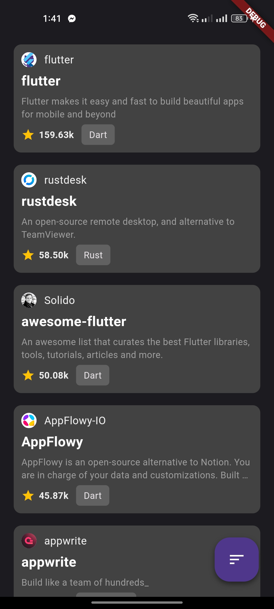

# repo_scout

This project is a repository explorer app that uses Flutter and [GitHub API](https://docs.github.com/en/rest/search?apiVersion=2022-11-28#search-repositories) to fetch and display a list of repositories based on the topic ["Flutter"](https://github.com/search?q=Flutter&type=repositories). The app demonstrates the use of state management, asynchronous operations, data persistence, pagination, sorting, caching, and error handling. The app also follows the best practices of coding, testing, and architecture. The app supports future authentication and authorization features. The app is scalable and maintainable for future enhancements.

## My Approach
- I have chosed **Repostiory Pattern** and for State Management I chose **BLoC**.
Both of them contribute to scalability and maintainability for future enhancements. 
- I have separated each concerns for clean, readable and reusable code structure. 
lib
├── api
│   ├── api.dart
│   └── http_manager.dart
├── db
│   └── local_db.dart
├── config
│   ├── connectivity.dart
│   └── routes.dart
├── bloc
│   ├── repo_bloc.dart
│   ├── repo_event.dart
│   └── repo_state.dart
├── repository
│    ├── repository.dart
│    ├── local_repository.dart
│    └── remote_repository.dart
├── models
│    ├── repo.dart
│    ├── query.dart
│    ├── owner.dart
│    ├── api_response.dart
│    └── api_response_mode.dart
├── main.dart
├── screens
│   ├── home
│   │   ├── home.dart
│   │   └── widget.dart
│   └── details
│   -   ├── details.dart
│   -   └── widget.dart
├── constants
│   ├── app_constants.dart
│   └── asset_path.dart
└── widgets
│   ├── option_widget.dart
│   └── owner.dart

- I have used [Dio](https://pub.dev/packages/dio) package for calling the API.
- I have used [Sqflite](https://pub.dev/packages/sqflite) for local data caching.
- For minimizing costly api calls I also added **throttling** via [bloc_event_transformers](https://pub.dev/packages/bloc_event_transformers)
- Done **unit tests** for network api calls and json serialization.

Basically this application can run on both online and offline mode. After first run in online, it caches all the fetched repos into local database. Next time when you enter the application without internet it shows the cached repos. You can also view their details.

For sorting I have 3 options:
1. Star counts
2. Fork counts
3. View counts

and ofcourse all of them can be ordered ascending or descending order.

The application uses **pagination** and fetches 10 repos everytime you scroll down to the end of the list.

## Architecture

I have used repository pattern with clear abstraction layers.
Currently this project has 2 repositories. 
1. Remote Repository (For fetching data over the internet)
2. Local Repository (For fetching and caching data into device)

The overall structure of the application is shown below:

## Screenshots

### Online Mode

 |
:-------------------------:|:-------------------------:
| 
| 

### Pagination

### Offline Mode
 |
:-------------------------:|:-------------------------:
| 

## Future Scopes

- Add search feature.
- Add Authentication and Autherization for user to interact with the other repositories.
- Ability to view, edit and delete own repos.
- Ability to view, comment on open issues.
- Ability to star, watch and fork repos.
- Ability to download the codebase from the repository.

## References
- [Dio](https://pub.dev/packages/dio)
- [Sqflite](https://pub.dev/packages/sqflite)
- [Bloc](https://pub.dev/packages/bloc)
- [Bloc Event Transformers](https://pub.dev/packages/bloc_event_transformers)